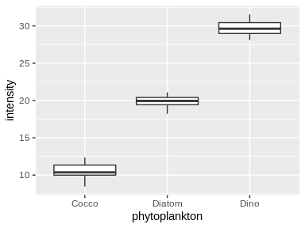
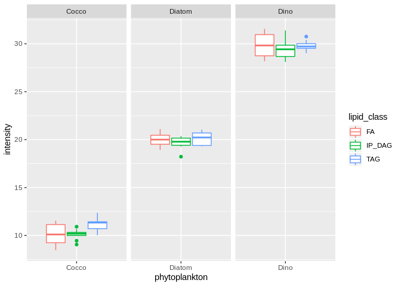
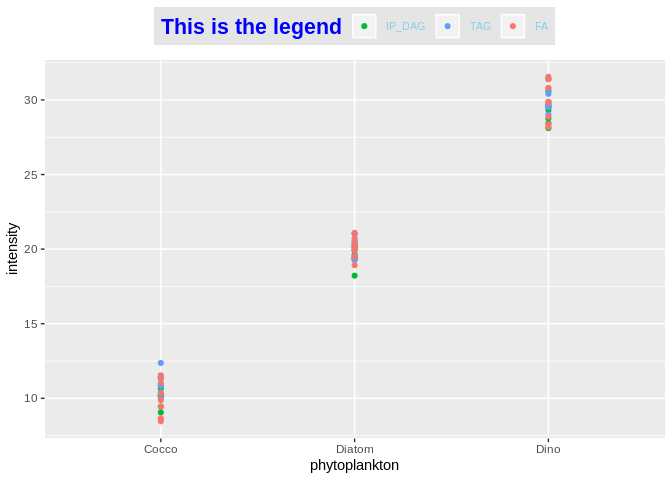
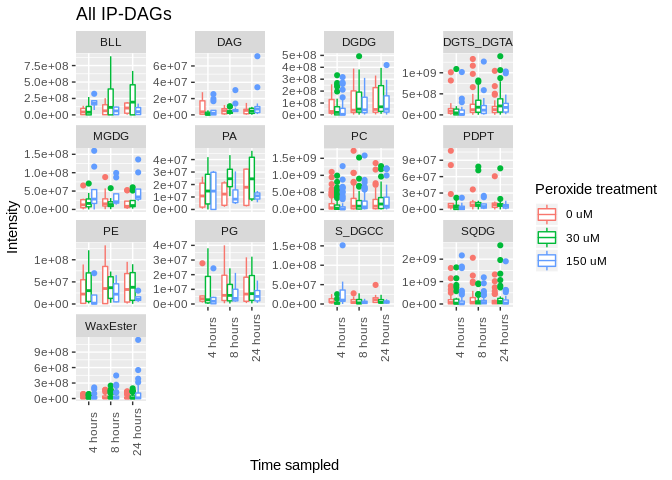

ggdemo
================

ggplot2 and dplyr
-----------------

ggplot2, dplyr, and reshape2 are packages that don't come with R automatically. Instead, they'll need to be downloaded. Use the below code if you haven't ever run it before:

> install.packages("ggplot2")

> install.packages("dplyr")

> install.packages("reshape2")

These packages are part of the so-called ["tidyverse"](https://www.tidyverse.org/) which collects packages that share the same underlying design philosophy. This makes it really easy to send data between different packages within the tidyverse, but also makes it harder to send things in and out.

Loading the libraries and LOBSTAHS data
---------------------------------------

I'll be demoing a lot of the ggplot functions using our LOBSTAHS data, freshly produced by Savio.

``` r
library(dplyr)
```

    ## 
    ## Attaching package: 'dplyr'

    ## The following objects are masked from 'package:stats':
    ## 
    ##     filter, lag

    ## The following objects are masked from 'package:base':
    ## 
    ##     intersect, setdiff, setequal, union

``` r
library(ggplot2)
library(reshape2)


#Read in the csv file from the working directory
LOBdata <- read.csv("LOBsetPos.csv")

#Check that it all looks pretty
head(LOBdata)
```

    ##     X peakgroup_mz peakgroup_mzmin peakgroup_mzmax peakgroup_rt
    ## 1   1     794.7237        794.7236        794.7238     1147.457
    ## 2   4     794.7237        794.7236        794.7238     1147.457
    ## 3  13     825.6943        825.6937        825.7741     1150.502
    ## 4  10     820.7388        820.7386        820.7390     1147.881
    ## 5 101     820.7388        820.7386        820.7390     1147.881
    ## 6  16     846.7541        846.7452        846.7545     1149.495
    ##   peakgroup_rtmin peakgroup_rtmax npeaks X0_uM_H2O2 X150_uM_H2O2
    ## 1        1129.195        1148.839     18          6            6
    ## 2        1129.195        1148.839     18          6            6
    ## 3        1130.490        1226.500     34          6            6
    ## 4        1129.195        1149.662     18          6            6
    ## 5        1129.195        1149.662     18          6            6
    ## 6        1124.704        1150.893     20          6            6
    ##   X30_uM_H2O2 X0uM_24h_Orbi_0468 X0uM_24h_Orbi_0473 X0uM_4h_Orbi_0475
    ## 1           6         1759238331          587111097        1080088231
    ## 2           6         1759238331          587111097        1080088231
    ## 3           6          714108442          470808360         650243615
    ## 4           6         3944777017         1628017283        2739306667
    ## 5           6         3944777017         1628017283        2739306667
    ## 6           6          166152303           77764205         174333637
    ##   X0uM_4h_Orbi_0476 X0uM_8h_Orbi_0472 X0uM_8h_Orbi_0477
    ## 1         252561657        2193152530        1887253460
    ## 2         252561657        2193152530        1887253460
    ## 3         248319307         841840899         838479127
    ## 4         688536440        4659104122        4662050162
    ## 5         688536440        4659104122        4662050162
    ## 6          46113305         232425046         399293461
    ##   X150uM_24h_Orbi_0466 X150uM_24h_Orbi_0469 X150uM_4h_Orbi_0474
    ## 1           4686760469           5875574740          2424730062
    ## 2           4686760469           5875574740          2424730062
    ## 3           1069355649           1012662746           127963908
    ## 4          10122069255          10343714215          6208683925
    ## 5          10122069255          10343714215          6208683925
    ## 6            434968770            551337226           394611248
    ##   X150uM_4h_Orbi_0478 X150uM_8h_Orbi_0467 X150uM_8h_Orbi_0471
    ## 1          1218033924          2015686221          4196998803
    ## 2          1218033924          2015686221          4196998803
    ## 3           696222452           701617994           986785793
    ## 4          3234811482          3693879587          7921142919
    ## 5          3234811482          3693879587          7921142919
    ## 6           173477172           162941503           350047940
    ##   X30uM_24h_Orbi_0470 X30uM_24h_Orbi_0479 X30uM_4h_Orbi_0465
    ## 1          1843987509          1077750227          930859238
    ## 2          1843987509          1077750227          930859238
    ## 3           764000360           743836855          439971486
    ## 4          4121624236          3498830384         2236608044
    ## 5          4121624236          3498830384         2236608044
    ## 6           235473835           264185523          163715796
    ##   X30uM_4h_Orbi_0480 X30uM_8h_Orbi_0463 X30uM_8h_Orbi_0464 xcms_peakgroup
    ## 1          420052611         2101444445         2480282536           1058
    ## 2          420052611         2101444445         2480282536           1058
    ## 3          357523111          760607936          997996652           1156
    ## 4         1151756074         4256310727         6991708236           1142
    ## 5         1151756074         4256310727         6991708236           1142
    ## 6           71746689          222112346          554622613           1223
    ##    isotopes CAMERA_pseudospectrum LOBdbase_frag_ID
    ## 1 [197][M]+                     1            43123
    ## 2 [197][M]+                     1            98681
    ## 3 [229][M]+                     1             9111
    ## 4 [226][M]+                     1            43788
    ## 5 [226][M]+                     1            99626
    ## 6                               1            10570
    ##   LOBdbase_exact_parent_neutral_mass LOBdbase_mz lipid_class
    ## 1                           776.6894    794.7232      IP_DAG
    ## 2                           776.6894    794.7232         TAG
    ## 3                           802.7050    825.6943      IP_MAG
    ## 4                           802.7050    820.7389      IP_DAG
    ## 5                           802.7050    820.7389         TAG
    ## 6                           828.7207    846.7545      IP_MAG
    ##             species major_adduct FA_total_no_C FA_total_no_DB
    ## 1               DAG     [M+NH4]+            46              2
    ## 2               TAG     [M+NH4]+            46              1
    ## 3 CoprostanolEsters      [M+Na]+            24              0
    ## 4               DAG     [M+NH4]+            48              3
    ## 5               TAG     [M+NH4]+            48              2
    ## 6 CholesterolEsters     [M+NH4]+            26              0
    ##   degree_oxidation elem_formula              compound_name C1 C1x C2a C2b
    ## 1                1     C49H92O6               DAG 46:2 +1O  0   0   0   1
    ## 2                0     C49H92O6                   TAG 46:1  0   0   0   1
    ## 3                4     C51H94O6 CoprostanolEsters 24:0 +4O  0   0   1   0
    ## 4                1     C51H94O6               DAG 48:3 +1O  0   0   0   1
    ## 5                0     C51H94O6                   TAG 48:2  0   0   0   1
    ## 6                4     C53H96O6 CholesterolEsters 26:0 +4O  1   0   0   0
    ##   C3c C3f C3r C4 C5 C6a C6b casecodes LOBdbase_ppm_match match_ID
    ## 1   0   1   0  0  0   0   0  C2b; C3f        -0.56712268        1
    ## 2   0   1   0  0  0   0   0  C2b; C3f        -0.56712268        2
    ## 3   0   0   0  0  0   0   0       C2a        -0.06246400        3
    ## 4   0   1   0  0  0   0   0  C2b; C3f         0.07276178        4
    ## 5   0   1   0  0  0   0   0  C2b; C3f         0.07276178        5
    ## 6   0   1   0  0  0   0   0   C1; C3f         0.50770793        6

``` r
#Save the names of the dataset as a variable
nms <- names(LOBdata)
```

Looks good! We've got all the columns we need. I've created a data dictionary for it below and bolded the columns that I use the most.

-   X: Line number in xcms
-   **peakgroup\_mz**: the m/z value of the peak group. This is essentially the mass of the lipid
-   peakgroup\_mzmin: the m/z value at which the peak starts
-   peakgroup\_mzmax: the m/z value at which the peak ends
-   **peakgroup\_rt**: the retention time of the peak group. This is how polar/non- polar the lipid is.
-   peakgroup\_rtmin: the retention time at which the peak starts
-   peakgroup\_rtmax: the retention time at which the peak ends
-   npeaks: the number of nicely defined peaks. Usually equal to the number of samples in the data set (18)
-   X0\_uM\_H2O2: the number of samples in the 0 uM hydrogen peroxide treatment
-   X150\_uM\_H2O2: the number of samples in the 150 uM hydrogen peroxide treatment
-   X30\_uM\_H2O2: the number of samples in the 30 uM hydrogen peroxide treatment
-   **Orbi\_whatever**: the intensity recorded for a given lipid for a given sample. This tells us how much of a given lipid is present.
-   xcms\_peakgroup: used for bug testing
-   isotopes: describes the isotopes found in the data set and possible overlaps
-   CAMERA\_pseudospectrum: used for bug testing
-   LOBdbase\_frag\_id: used by LOBSTAHS when working with MS<sup>n</sup> data
-   LOBdbase\_exact\_parent\_neutral\_mass: the exact mass of the parent lipid, determined by subtracting the mass of the adduct
-   **LOBdbase\_mz**: the mass of the lipid plus the mass of the adduct.
    -   This one is bolded because we use it in Maven to look for as specific lipid.
-   **lipid\_class**: the lipid class (see Fahy 2005) that the lipid belongs to.
    -   IP\_DAG, TAG, pigment, etc.
-   **species**: the lipid species the lipid belongs to
    -   PC, PE, PG, MGDG, SQDG, etc.
-   major\_adduct: determined by the lipid class, provides the major adduct that the lipid will form
    -   NOTE: LOBSTAHS *only* uses this major adduct, and minor adducts are discarded
-   FA\_total\_no\_C: the total number of carbons in the fatty acid chains of the lipid
-   FA\_total\_no\_DB: the total number of double bonds in the lipid
-   degree\_oxidation: the degree of oxidation for a given lipid
-   elem\_formula: the elemental formula of the given lipid compound. Usually not unique due to regioisomers
-   **compound\_name**: the name of the compound. Includes oxidation information
-   **the C series**: measures of confidence in the sample annotation. See Collins et al. 2016
    -   C1: Denotes a good, high confidence annotation
    -   C1x: Denotes a good, high confidence annotation
    -   C2a: Denotes a good, high confidence annotation
    -   C2b: Denotes a good, high confidence annotation
    -   C3r: Denotes regioisomers
    -   C3f: Compound's m/z was identical to a competing assignment
    -   C3c: Compounds isobaric to this were also present
    -   C4: Lipid species was *not* formed by a major adduct and was thus discarded
    -   C5: Lipid species was *not* formed by a major adduct and was thus discarded
    -   C6a: ???
    -   C6b: ???
-   casecodes: lists the C series that the compound was flagged with
-   LOBdbase\_ppm\_match: describes how closely the observed peak matches the expected. Calculated by the formula ppm= (m/z\_{obs}-m/z\_{database})/m/z\_{database}\*10^6
-   match\_ID: Line number in LOBSTAHS

Phew. Let's simplify our LOBSTAHS dataset by just grabbing the columns and rows we wantand organizing them more nicely.

Cleaning up the data
--------------------

Now, the data here is *everything*. But for exploratory and introductory analyses, we don't want to have to reference thick books and consolidate retention times - we'd rather just use the high-confidence annotations. To do that, I'll be filtering out the rows that belong to either C1, C1x, C2a or C2b. The command here is filter(), from dplyr, which lets me grab rows based on the value of a given row. I'll do this a couple different ways.

``` r
#The long, terrible way: throw out each non-high-confidence annotation one at a time
clean_LOBdata <- filter(LOBdata, LOBdata$C3c!=1)
clean_LOBdata <- filter(clean_LOBdata, C3f!=1)
clean_LOBdata <- filter(clean_LOBdata, C3r!=1)
clean_LOBdata <- filter(clean_LOBdata, C4!=1)
clean_LOBdata <- filter(clean_LOBdata, C5!=1)
clean_LOBdata <- filter(clean_LOBdata, C6a!=1)
clean_LOBdata <- filter(clean_LOBdata, C6b!=1)


#The logical way
clean_LOBdata <- filter(LOBdata, C3c!=1 & C3f!=1 & C3r!=1 & C4!=1 & C5!=1 &
                          C6a!=1 & C6b!=1)
    #The ampersand above is used as an "and" logic operator

#The *almost* dplyr way
clean_LOBdata <- filter(mutate(LOBdata, ConfVals=C3c+C3f+C3r+C4+C5+C6a+C6b),
                        ConfVals==0)

#The dplyr way
clean_LOBdata <- LOBdata %>%
  mutate(ConfVals=C3c+C3f+C3r+C4+C5+C6a+C6b) %>%
  filter(ConfVals==0)
    #The %>% is called a "pipe" and passes output from one function to the 
    #other. This makes the code that would normally be nested much more readable
```

The above code reduces our data set from two thousand compounds down to 223, but we're *very* sure all of those are what we think they are. Now that the rows are nice, we can clean up the columns.

Here, I'll be using the "select" command from the dplyr package. It lets me grab columns by either number or name.

``` r
clean_LOBdata <- select(clean_LOBdata, 
                        c("match_ID", "lipid_class", "compound_name", "species",
                          "peakgroup_mz", "peakgroup_rt", 12:29))
    #Notice that I'm able to use both column names and the column index to grab
    #these values, rather than needing to list out the Orbi names
```

Let's take a look at our shiny clean data:

``` r
head(clean_LOBdata)
```

    ##   match_ID lipid_class              compound_name           species
    ## 1        3      IP_MAG CoprostanolEsters 24:0 +4O CoprostanolEsters
    ## 2       10      IP_DAG              DGDG 46:6 +3O              DGDG
    ## 3       11      IP_MAG     CholesterolEsters 16:3 CholesterolEsters
    ## 4       13         TAG              TAG 58:13 +4O               TAG
    ## 5       14      IP_DAG              DGDG 40:2 +3O              DGDG
    ## 6       17      IP_MAG CoprostanolEsters 22:0 +4O CoprostanolEsters
    ##   peakgroup_mz peakgroup_rt X0uM_24h_Orbi_0468 X0uM_24h_Orbi_0473
    ## 1     825.6943    1150.5016          714108442          470808360
    ## 2    1142.7538     970.2728          320154996          229290265
    ## 3     636.5713     973.8676            2673205            1821619
    ## 4    1002.7041     973.3629           32300881           20257907
    ## 5    1066.7222     971.4368           30647366           23449803
    ## 6     797.6632    1117.5030          230202099          116945425
    ##   X0uM_4h_Orbi_0475 X0uM_4h_Orbi_0476 X0uM_8h_Orbi_0472 X0uM_8h_Orbi_0477
    ## 1         650243615         248319307         841840899         838479127
    ## 2         184352461         254095868         231537522         290111198
    ## 3           1317428           1623522           2349873           2487119
    ## 4          26052131          37085114          23460933           9630846
    ## 5          14964384          21964069          20291644          26471034
    ## 6         205180279          60097130         255793095         208146193
    ##   X150uM_24h_Orbi_0466 X150uM_24h_Orbi_0469 X150uM_4h_Orbi_0474
    ## 1           1069355649           1012662746        127963908.02
    ## 2            257003818            279406708                0.00
    ## 3              4034757              4419243            28882.65
    ## 4             26748922             34315059                0.00
    ## 5             28215509             35269022                0.00
    ## 6            407601031            339505964        298858808.04
    ##   X150uM_4h_Orbi_0478 X150uM_8h_Orbi_0467 X150uM_8h_Orbi_0471
    ## 1           696222452           701617994           986785793
    ## 2           272015831           218370566           311423575
    ## 3             2167993             3087916             4992597
    ## 4            32314457            34589420            33657225
    ## 5            25981636            21161138            29412353
    ## 6           202587081           207542512           392346407
    ##   X30uM_24h_Orbi_0470 X30uM_24h_Orbi_0479 X30uM_4h_Orbi_0465
    ## 1           764000360           743836855       439971486.21
    ## 2           395277378           286465196        74900235.48
    ## 3             2611355             2172521           54079.43
    ## 4            41745112             4191879          270759.19
    ## 5            47234386            40447099           32262.42
    ## 6           232272093           183385678       143961777.37
    ##   X30uM_4h_Orbi_0480 X30uM_8h_Orbi_0463 X30uM_8h_Orbi_0464
    ## 1          357523111          760607936          997996652
    ## 2          252811747          247735610          356681517
    ## 3            1460132            1992834            3120281
    ## 4           21868624           35932216           52319941
    ## 5           24897072           24025353           38152577
    ## 6           93519884          252880819          240142707

Lovely! There's one more step we should take, and that's the conversion of this "wide" data set to "long" format. ggplot only likes data in "long" format, so we might as well take care of this now. Right now, each of our samples has its own column. What we'd like is for that all to fit into two simple columns: one called "sample" and one called "value". Check out [this link](https://en.wikipedia.org/wiki/Wide_and_narrow_data) if that doesn't make sense. There's also a few discussions online about it with better examples.

``` r
long_LOBdata <- clean_LOBdata %>%
  melt(id=c("match_ID", "lipid_class", "compound_name", "species", 
            "peakgroup_mz", "peakgroup_rt"), 
       variable.name="sample", value.name = "intensity")

head(long_LOBdata)
```

    ##   match_ID lipid_class              compound_name           species
    ## 1        3      IP_MAG CoprostanolEsters 24:0 +4O CoprostanolEsters
    ## 2       10      IP_DAG              DGDG 46:6 +3O              DGDG
    ## 3       11      IP_MAG     CholesterolEsters 16:3 CholesterolEsters
    ## 4       13         TAG              TAG 58:13 +4O               TAG
    ## 5       14      IP_DAG              DGDG 40:2 +3O              DGDG
    ## 6       17      IP_MAG CoprostanolEsters 22:0 +4O CoprostanolEsters
    ##   peakgroup_mz peakgroup_rt             sample intensity
    ## 1     825.6943    1150.5016 X0uM_24h_Orbi_0468 714108442
    ## 2    1142.7538     970.2728 X0uM_24h_Orbi_0468 320154996
    ## 3     636.5713     973.8676 X0uM_24h_Orbi_0468   2673205
    ## 4    1002.7041     973.3629 X0uM_24h_Orbi_0468  32300881
    ## 5    1066.7222     971.4368 X0uM_24h_Orbi_0468  30647366
    ## 6     797.6632    1117.5030 X0uM_24h_Orbi_0468 230202099

Finally, let's break up the new "Sample" column into something more useful. Right now, R doesn't know that we have samples from 0, 8, and 24 hours as well as 3 different treatments. We'll use the mutate() function here to create new columns at the end of the data frame to hold this new info.

``` r
long_LOBdata <- long_LOBdata %>%
  mutate(treatment=paste(regmatches(sample, regexpr("[[:digit:]]+", sample)), "uM"),
         time_point=sub("_", "", paste(regmatches(sample, regexpr("_[[:digit:]]+", sample)), "hours")),
         sample=paste("Orbi_", regmatches(sample, regexpr("04[[:digit:]]+", sample))))
    #Use regular expressions to extract the relevant info from the sample name

head(long_LOBdata)
```

    ##   match_ID lipid_class              compound_name           species
    ## 1        3      IP_MAG CoprostanolEsters 24:0 +4O CoprostanolEsters
    ## 2       10      IP_DAG              DGDG 46:6 +3O              DGDG
    ## 3       11      IP_MAG     CholesterolEsters 16:3 CholesterolEsters
    ## 4       13         TAG              TAG 58:13 +4O               TAG
    ## 5       14      IP_DAG              DGDG 40:2 +3O              DGDG
    ## 6       17      IP_MAG CoprostanolEsters 22:0 +4O CoprostanolEsters
    ##   peakgroup_mz peakgroup_rt     sample intensity treatment time_point
    ## 1     825.6943    1150.5016 Orbi_ 0468 714108442      0 uM   24 hours
    ## 2    1142.7538     970.2728 Orbi_ 0468 320154996      0 uM   24 hours
    ## 3     636.5713     973.8676 Orbi_ 0468   2673205      0 uM   24 hours
    ## 4    1002.7041     973.3629 Orbi_ 0468  32300881      0 uM   24 hours
    ## 5    1066.7222     971.4368 Orbi_ 0468  30647366      0 uM   24 hours
    ## 6     797.6632    1117.5030 Orbi_ 0468 230202099      0 uM   24 hours

Excellent. Now that's a data set we can work with!

ggplotting
----------

ggplots are built in a layered format, just like base plots, but they're all written on the same line of code and connected via "+" signs.

All ggplots consist of 3 things - a call to ggplot(), a "geom" that determines what shape the plot will be, and "aes()"thetics that actually fill in the data. For example, a "skeleton" ggplot call might be:

> ggplot() + geom\_something(data=, aes(x= ))

However, this format is flexible. Data could be called by the ggplot, or the aes call could go there. In the future, this will make a difference, but for right now it's flexible.

Some common ggplots are shown below:

``` r
#Create some fake data in long format
phytoplankton <- rep(c("Diatom", "Cocco", "Dino"), each=24)
lipid_class <- rep(rep(c("IP_DAG", "TAG", "FA"), each=8), 3)
intensity <- rep(c(20, 10, 30), each=24)+rnorm(72)
df <- data.frame(phytoplankton, lipid_class, intensity)

    #Always a good place to start
ggplot() + geom_point(data = df, aes(x=phytoplankton, y=intensity))
```


``` r
    #Jittering spreads out the data to avoid overlap
ggplot(data = df) + geom_jitter(aes(x=phytoplankton, y=intensity))
```


``` r
    #Boxplots are a nice way to present this data
ggplot(data = df, aes(x=phytoplankton, y=intensity)) + geom_boxplot()
```



However, ggplot also has a lot of customization options, just like base plot. Let's add some color to these - note that ggplot automatically slices the data for us, rather than having to make several separate calls to boxplot in different colors

``` r
ggplot(data = df) + geom_boxplot(aes(x=phytoplankton, 
                                     y=intensity, 
                                     color=lipid_class))
```


Sometimes, it's a good idea to "facet" your data, or present it in entirely separate regions within the plot area. To do this, we add (+) the facet\_wrap() layer. There's a tilde (~) before the thing you're wrapping around, don't forget!

``` r
ggplot(data = df) + 
  geom_boxplot(aes(x=phytoplankton, y=intensity, color=lipid_class)) +
  facet_wrap(~phytoplankton, scales = "free_x")
```



``` r
ggplot(data = df) + 
  geom_boxplot(aes(x=phytoplankton, y=intensity, color=lipid_class)) +
  facet_wrap(~lipid_class)
```


Note that slicing the data in this way lets us compare two different things. In the first one, we're emphasizing the similarity of the lipid classes within the organisms. In the second, we're emphasizing how each phytoplankter has a significantly different lipid signature from the others.

As with base plot, you can control the axes, text, and titles, but here it's all done with the addition of a new layer by "+" rather than a second line.

``` r
ggplot() + geom_jitter(data=df, aes(x=phytoplankton, y=intensity, color=lipid_class)) +
  ylab("") + #remove y axis
  xlab("This is the x axis") + #add x axis label
  ggtitle("This is the title") + #add a title
  scale_x_discrete(breaks=c("Diatom", "Cocco", "Dino"), #move x axis around
                   labels=c("Bacillariophyceae", "Coccolithophore", "Dinoflagellate"))+
  scale_y_continuous(breaks = seq(10,30,1)) + #make finer slices in the background
  theme(axis.title.x = element_text(face="bold", colour="#990000", size=20)) #change axis text color
```


You may have also noticed that ggplot creates a legend on the side by default - which is great, unless it becomes another thing to change.

``` r
ggplot(data = df, aes(x=phytoplankton, y=intensity, color=lipid_class)) + 
  geom_point() +
  scale_color_discrete(breaks=c("IP_DAG", "TAG", "FA"),#change the order
                       name="This is the legend") + #change the title
  theme(legend.title = element_text(colour="blue", size=16, face="bold"),
        legend.text = element_text(color = "skyblue", size = 8), #change text colors
  legend.background = element_rect(fill="gray90", size=.5, linetype="dotted"), #add a background
  legend.position = "top") #move it to the top
```



Some LOBSTAHS plots
-------------------

Let's recreate the plots we covered in the demo session. We've already got our dataset cleaned up and ready to go, so we can jump right in to graphing it.

``` r
ggplot(data = long_LOBdata) + geom_point(aes(x=peakgroup_rt, y=peakgroup_mz,
                                          color=species))
```


Looks pretty busy. Let's clear out all the lipid species that Collins et al. also didn't use - leaving behind PC, PE, PG, SQDG, TAG, DGCC, DGDG, and DGTS\_DGTA.

``` r
#First, filter out everything that isn't what we want
species_to_keep <- c("PC", "PE", "PG", "SQDG", "TAG", "DGCC", "DGDG", "DGTS_DGTA")
collins_LOBdata <- filter(long_LOBdata, species%in%species_to_keep)

ggplot(data = collins_LOBdata) + 
  geom_point(aes(x=peakgroup_rt, y=peakgroup_mz, color=species)) +
  ylab("m/z") +
  xlab("Corrected retention time (min)") +
  scale_color_discrete(name="Lipid species") +
  theme(axis.title.y = element_text(face="italic"))
```


Looks good! Collins et al. also used the oxidation degree to add shapes, but that's a good exercise for you to try on your own. (Hint: you'll have to add an degree\_oxidation column to long\_LOBdata, and the ggplot argument is "shape")

We can also compare specific lipid species across the three treatments and watch how they change over time:

``` r
IPDAGs <- filter(long_LOBdata, lipid_class=="IP_DAG")

#Define custom factor levels so the facets and boxplots are in the right order
IPDAGs$treatment <- factor(IPDAGs$treatment, levels=c("0 uM", "30 uM", "150 uM"))
IPDAGs$time_point <- factor(IPDAGs$time_point, levels = c("4 hours", "8 hours", "24 hours"))

ggplot(data = IPDAGs) + geom_boxplot(aes(x=time_point, y=intensity, color=species)) +
  facet_wrap(~treatment)
```


``` r
#Better way to slice the data:
ggplot(data = IPDAGs) + geom_boxplot(aes(x=time_point, y=intensity, color=treatment)) +
  facet_wrap(~species, scales = "free_y") +
  theme(axis.text.x  = element_text(angle=90, vjust=1)) +
  ylab("Intensity") +
  xlab("Time sampled") +
  ggtitle("All IP-DAGs") +
  scale_color_discrete(name="Peroxide treatment")
```



``` r
ggplot(data = IPDAGs) + geom_boxplot(aes(x=treatment, y=intensity, color=time_point)) +
  facet_wrap(~species, scales = "free_y") +
  theme(axis.text.x  = element_text(angle=90, vjust=1)) +
  ylab("Intensity") +
  xlab("Peroxide treatment") +
  ggtitle("All IP-DAGs") +
  scale_color_discrete(name="Time sampled")
```


``` r
#What's that? An interesting subgroup analysis?

BLLs <- filter(long_LOBdata, species=="BLL")
ggplot(data = IPDAGs) + geom_boxplot(aes(x=treatment, y=intensity, color=time_point)) +
  theme(axis.text.x  = element_text(angle=90, vjust=1)) +
  ylab("Intensity") +
  xlab("Peroxide treatment") +
  ggtitle("BLL subgroup analysis") +
  scale_color_discrete(name="Time sampled")
```


Finally, we can use some of the code I wrote over the summer to get a better sense for how the lipidome changes across these samples.

Heatmap of the lipidome across samples, grouped by lipid species:

``` r
fold_samps <- long_LOBdata %>%
  group_by(sample) %>%
  mutate(fold_change = log2(intensity/mean(intensity)))

ggplot(data = fold_samps, aes(x=species, y=sample)) + 
  geom_tile(aes(fill=fold_change), color="white") +
  scale_fill_gradient2(low = "darkorchid4", mid = "grey90", high = "darkgreen", na.value = "grey90") +
  theme(axis.text.x = element_text(angle = 60, hjust = 1)) +
  ylab("Sample number") + xlab("Lipid Species")
```


Note that these haven't been normalized to DNPPE (the internal standard) - might be another good thing to try doing on your own!

``` r
norm.rel.IPDAGs <- IPDAGs %>%
  group_by(sample) %>%
  mutate(proportion=(intensity/sum(intensity))*100)

#Aaaaand replot.
norm.rel.IPDAGs %>% group_by(sample) %>%
  ggplot(aes(x=sample, y=proportion)) + 
  geom_bar(aes(fill=species), stat = "identity") +
  theme(axis.text.x = element_text(angle = 60, hjust = 1)) +
  ylab("Relative proportion") + xlab("Sample") +
  scale_fill_discrete(name="Lipid Species") +
  ggtitle("IP-DAGs in the PtH2O2lipids Dataset")
```


Et voila!
